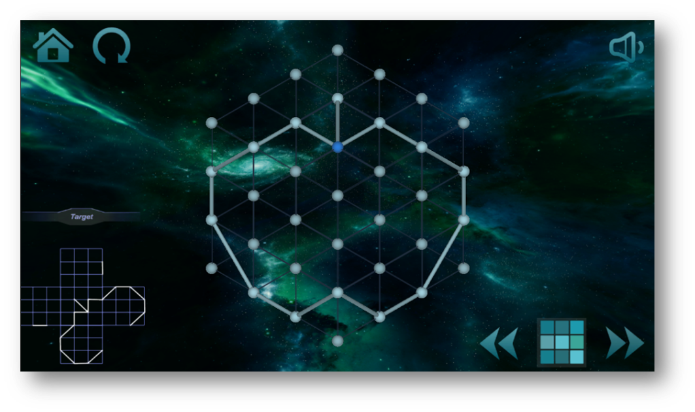

# unity_zasa

### introduction

A simple game simulating the popular app "Zasa" developed with unity engine.

### platform
We have released versions supporting:
* windows x86_64
* linux x86_64
* android 
original resolution : 1600*900

### screenshot

